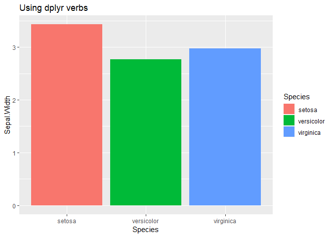

pipes
=====

Install and attach package:

``` r
# install.packages("devtools")
devtools::install_github("moodymudskipper/pipes")
library(pipes)
```

The *pipes* package expands the *magrittr* package by providing :

-   More pipe operators to debug, print extra info, suppress warnings or messages etc
-   A convenient way to create custom pipes
-   A couple of pipe friendly functions for printing (`pprint`) and testing (`pif`).

The package works just as *magrittr* except that:

-   `alias` functions were not imported
-   pipes have a class `pipe` and have a dedicated printing method

*magrittr* doesn't need to be attached, but attaching it before *pipes* will make the alias functions available.

New operators
-------------

-   **`%D>%`** : Debug the pipe chain at the relevant step
-   **`%V>%`** : Use `View()` on the output
-   **`%L>%`** : Log the relevant call and execution time to the console
-   **`%P>%`** : Use `print()` on the output
-   **`%summary>%`** : Print the `summary()` off the output
-   **`%glimpse>%`** : Use `tibble::glimpse()` on the output
-   **`%skim>%`** : Use `skimr::skim()` on the output
-   **`%ae>%`** : Use `all.equal` on the input and output
-   **`%compare>%`** : Use `arsenal::compare()` and open the report of the differences in the default browser window
-   **`%gg>%`** : Apply the `rhs` to the data of a `gg` object and return the modified `gg` object
-   **`%nowarn>%`** : Silence warnings
-   **`%nomsg>%`** : Silence messages
-   **`%strict>%`** : Fail on warning
-   **`%try>%`** : Try, and in case of failure prints error and returns input
-   **`%quietly>%`** : Use `purrr::quietly()` to capture outputs of all kind and print them

Let's showcase a few of them.

debug the chain:

``` r
iris %>% head(2) %D>% `[`(4:5)
```

view steps of chain in the viewer:

``` r
iris %V>% head(2) %V>% `[`(4:5)
```

Log steps in the console:

``` r
iris %L>% {Sys.sleep(1);head(.,2)} %L>% {Sys.sleep(2);.[4:5]}
#> {
#>     Sys.sleep(1)
#>     head(., 2)
#> }   ~ ... 1 sec
#> {
#>     Sys.sleep(2)
#>     .[4:5]
#> }   ~ ... 2 sec
#>   Petal.Width Species
#> 1         0.2  setosa
#> 2         0.2  setosa
```

Use `print`, `summary` or `glimpse` on output:

``` r
iris %P>% head(2) %P>% `[`(4:5)
#> head(., 2)
#>   Sepal.Length Sepal.Width Petal.Length Petal.Width Species
#> 1          5.1         3.5          1.4         0.2  setosa
#> 2          4.9         3.0          1.4         0.2  setosa
#> .[4:5]
#>   Petal.Width Species
#> 1         0.2  setosa
#> 2         0.2  setosa
#>   Petal.Width Species
#> 1         0.2  setosa
#> 2         0.2  setosa

iris %summary>% head(2) %summary>% `[`(4:5)
#> head(., 2)
#>   Sepal.Length   Sepal.Width     Petal.Length  Petal.Width        Species 
#>  Min.   :4.90   Min.   :3.000   Min.   :1.4   Min.   :0.2   setosa    :2  
#>  1st Qu.:4.95   1st Qu.:3.125   1st Qu.:1.4   1st Qu.:0.2   versicolor:0  
#>  Median :5.00   Median :3.250   Median :1.4   Median :0.2   virginica :0  
#>  Mean   :5.00   Mean   :3.250   Mean   :1.4   Mean   :0.2                 
#>  3rd Qu.:5.05   3rd Qu.:3.375   3rd Qu.:1.4   3rd Qu.:0.2                 
#>  Max.   :5.10   Max.   :3.500   Max.   :1.4   Max.   :0.2
#> .[4:5]
#>   Petal.Width        Species 
#>  Min.   :0.2   setosa    :2  
#>  1st Qu.:0.2   versicolor:0  
#>  Median :0.2   virginica :0  
#>  Mean   :0.2                 
#>  3rd Qu.:0.2                 
#>  Max.   :0.2
#>   Petal.Width Species
#> 1         0.2  setosa
#> 2         0.2  setosa

iris %glimpse>% head(2) %glimpse>% `[`(4:5)
#> Loading required namespace: tibble
#> head(., 2)
#> Observations: 2
#> Variables: 5
#> $ Sepal.Length <dbl> 5.1, 4.9
#> $ Sepal.Width  <dbl> 3.5, 3.0
#> $ Petal.Length <dbl> 1.4, 1.4
#> $ Petal.Width  <dbl> 0.2, 0.2
#> $ Species      <fct> setosa, setosa
#>   Sepal.Length Sepal.Width Petal.Length Petal.Width Species
#> 1          5.1         3.5          1.4         0.2  setosa
#> 2          4.9         3.0          1.4         0.2  setosa
#> .[4:5]
#> Observations: 2
#> Variables: 2
#> $ Petal.Width <dbl> 0.2, 0.2
#> $ Species     <fct> setosa, setosa
#>   Petal.Width Species
#> 1         0.2  setosa
#> 2         0.2  setosa
#>   Petal.Width Species
#> 1         0.2  setosa
#> 2         0.2  setosa
```

Use `all.equal` on input and output, note that the method for tibbles gives a different output.

``` r
iris %>% head(2) %ae>% 
  transform(Species = as.character(Species), cst = 42)
#> transform(., Species = as.character(Species), cst = 42)
#> [1] "Length mismatch: comparison on first 5 components"
#> [2] "Component \"Species\": 'current' is not a factor"
#>   Sepal.Length Sepal.Width Petal.Length Petal.Width Species cst
#> 1          5.1         3.5          1.4         0.2  setosa  42
#> 2          4.9         3.0          1.4         0.2  setosa  42

iris %>% tibble::as_tibble() %>% head(2) %ae>% 
  transform(Species = as.character(Species), cst = 42)
#> transform(., Species = as.character(Species), cst = 42)
#> [1] "Attributes: < Component \"class\": 1 string mismatch >"
#> [2] "Length mismatch: comparison on first 5 components"     
#> [3] "Component \"Species\": 'current' is not a factor"
#>   Sepal.Length Sepal.Width Petal.Length Petal.Width Species cst
#> 1          5.1         3.5          1.4         0.2  setosa  42
#> 2          4.9         3.0          1.4         0.2  setosa  42
```

Use `arsenal::compare` on input and output, and opens a markdown report written into a temp file.

``` r
iris %>% head(2) %compare>% 
  transform(Species = as.character(Species), cst = 42)
```

Use *tidyverse* syntax to mofidy a *gg* object's underlying data:

``` r
library(ggplot2,quietly = TRUE, warn.conflicts = FALSE)
ggplot(iris, aes(Species, Sepal.Width, fill=Species)) +
  geom_col() %gg>% dplyr::group_by(Species) %gg>% dplyr::summarize_at("Sepal.Width", mean) +
  ggtitle("Using dplyr verbs")
```



Silence a warning or a message:

``` r
-1  %>% sqrt
#> Warning in sqrt(.): production de NaN
#> [1] NaN
-1  %nowarn>% sqrt
#> [1] NaN
iris[50:51,3:5] %>% dplyr::left_join(iris[50:51,c(1:2,5)])
#> Joining, by = "Species"
#>   Petal.Length Petal.Width    Species Sepal.Length Sepal.Width
#> 1          1.4         0.2     setosa            5         3.3
#> 2          4.7         1.4 versicolor            7         3.2
iris[50:51,3:5] %nomsg>% dplyr::left_join(iris[50:51,c(1:2,5)])
#>   Petal.Length Petal.Width    Species Sepal.Length Sepal.Width
#> 1          1.4         0.2     setosa            5         3.3
#> 2          4.7         1.4 versicolor            7         3.2
```

Strictly fail on a warning

``` r
try(-1  %strict>% sqrt())
```

Try, and in case of failure prints error and returns input

``` r
"a"  %try>% log()
#> [1] "a"
```

Use `quietly` to capture outputs of all kind and print them.

``` r
iris[50:51,3:5] %quietly>% 
  dplyr::left_join(iris[50:51,c(1:2,5)]) %quietly>%
  dplyr::mutate(Petal.Length = - Petal.Length, Petal.Length = sqrt(Petal.Length))
#> dplyr::left_join(., iris[50:51, c(1:2, 5)]) 
#> $messages
#> [1] "Joining, by = \"Species\"\n"
#> 
#> 
#> dplyr::mutate(., Petal.Length = -Petal.Length, Petal.Length = sqrt(Petal.Length)) 
#> $warnings
#> [1] "production de NaN"
#>   Petal.Length Petal.Width    Species Sepal.Length Sepal.Width
#> 1          NaN         0.2     setosa            5         3.3
#> 2          NaN         1.4 versicolor            7         3.2
```

`new_pipe`
----------

It's easier to understand how to build a new `pipe` by looking at examples.

``` r
 `%T>%`
#> Special pipe operator
#> wrap:
#> {
#>     local(BODY)
#>     .
#> }
```

If we want to rebuild this operator from scratch, all we have to do is :

``` r
`%newT>%` <- new_pipe({
  local(BODY)
  .
})
```

`.` is the value of the input and `BODY` contains the code that would have been executed by `%>%`, for example `iris %>% head(3)` `BODY` would be `head(.,3)`.

so what `%newT>%` is doing is executing the call in a protected environment through `local(BODY)`, then returning the unaltered input `.`.

``` r
iris %>% head(2) %newT>% print %>% head(1)
#>   Sepal.Length Sepal.Width Petal.Length Petal.Width Species
#> 1          5.1         3.5          1.4         0.2  setosa
#> 2          4.9         3.0          1.4         0.2  setosa
#>   Sepal.Length Sepal.Width Petal.Length Petal.Width Species
#> 1          5.1         3.5          1.4         0.2  setosa
```

Take a look at the other functions to understand how to make your own :

``` r
`%nowarn>%`
#> Special pipe operator
#> wrap:
#> suppressWarnings(BODY)
`%P>%`
#> Special pipe operator
#> wrap:
#> {
#>     message(deparse(quote(BODY)))
#>     . <- print(BODY)
#>     cat("\n")
#>     .
#> }
`%summary>%`
#> Special pipe operator
#> wrap:
#> {
#>     message(deparse(quote(BODY)))
#>     . <- BODY
#>     print(summary(.))
#>     cat("\n")
#>     .
#> }
`%strict>%`
#> Special pipe operator
#> wrap:
#> {
#>     current_warn <- options()$warn
#>     options(warn = 2)
#>     on.exit(options(warn = current_warn))
#>     BODY
#> }
```

easy conditional steps with `pif`
---------------------------------

Using functions, formulas or expressions

``` r
iris %>% pif(is.data.frame, dim, nrow)
#> [1] 150   5
iris %>% pif(~is.numeric(Species), ~"numeric :)",~paste(class(Species)[1],":("))
#> [1] "factor :("
iris %>% pif(nrow(iris) > 2, head(iris,2))
#>   Sepal.Length Sepal.Width Petal.Length Petal.Width Species
#> 1          5.1         3.5          1.4         0.2  setosa
#> 2          4.9         3.0          1.4         0.2  setosa
```

print info on intermediate steps with `pprint`
----------------------------------------------

``` r
iris %>%
  pprint(~"hello")           %>%
  head(2)                    %>%
  transform(Species = NULL)  %>%
  pprint(rowSums,na.rm = TRUE) %>%
  pprint(~setNames(.[1:2],toupper(names(.[1:2])))) %>%
  pprint(dim)
#> [1] "hello"
#>    1    2 
#> 10.2  9.5 
#>   SEPAL.LENGTH SEPAL.WIDTH
#> 1          5.1         3.5
#> 2          4.9         3.0
#> [1] 2 4
```
